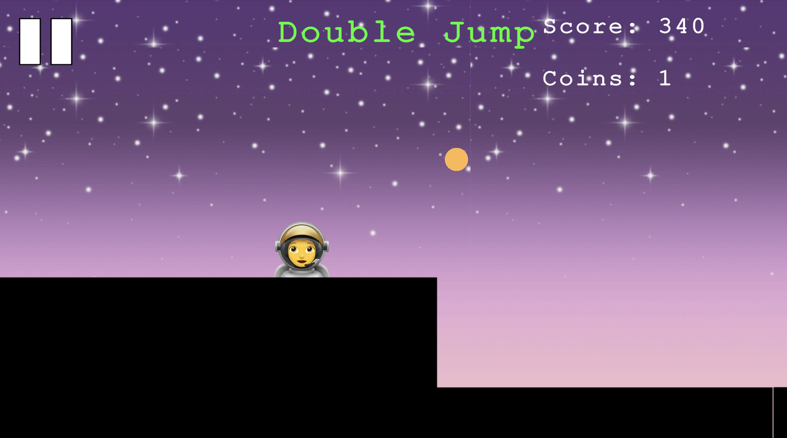

# 🚀 AstroSprint

AstroSprint is a 2D endless runner game built in Unity where players dodge obstacles, collect coins, and use power-ups to achieve the highest score possible. Designed for accessibility and replayability, AstroSprint combines competitive self-improvement with engaging mechanics such as abilities, upgrades, and negative power-downs.

---

## 📑 Index
- [About](#about)  
- [Usage](#usage)  
  - [Installation](#installation)  
- [Development](#development)  
  - [Pre-Requisites](#pre-requisites)  
  - [Development Environment](#development-environment)  
- [Gallery](#gallery)  
- [License](#license)  

---

## 📖 About
AstroSprint was developed as part of an A-Level Computer Science project.  

**Game features include:**  
- Endless runner gameplay loop  
- Power-ups such as Double Jump, Double Coins, Double Score, Flying, and negative power-downs for increased challenge  
- In-game currency and upgrade system  
- Multiple characters to unlock and play with  
- Easy and Hard modes with progressive difficulty  
- External database integration via Microsoft PlayFab to store highscores, coins, and upgrades  

📄 For the complete 300+ page design and technical write-up, see the full documentation:  
[AstroSprint Documentation.pdf](docs/AstroSprint%20Documentation.pdf)  

---

## 🎮 Usage

### Installation
To run this project locally:  

**Clone the repository**
```bash
git clone https://github.com/your-username/AstroSprint.git
cd AstroSprint
```
**Open in Unity**  
1. Install Unity (recommended version: 2021.x or newer)  
2. Open Unity Hub, click Add, and select the project folder  

**Play the game**  
- Press the ▶️ Play button in the Unity Editor  

**Build the game (optional)**  
1. Go to File > Build Settings  
2. Select your target platform (Windows, macOS, Linux)  
3. Click Build and Run to create a standalone executable  

---

## 🛠️ Development

### Pre-Requisites
1. Unity (2021.x or newer)  
2. Visual Studio Code (or another C# IDE)  
3. Internet connection for database features (PlayFab integration)  

### Development Environment
1. Clone the repository into a local folder  
2. Open the project in Unity Hub  
3. Scripts are written in C# and located in the `Assets/Scripts/` folder  
4. PlayFab is used for external database storage of highscores, coins, characters, and upgrades  

---

## 📸 Gallery

**Gameplay** 
<p align="center">
  
  
</p>

<p align="center">
  <em>Gameplay examples showing the endless runner mechanics, power-ups, and UI.</em>
</p>

**Menus**
<p align="center">
  
  
  
  
  
</p>

<p align="center">
  <em>Screenshots showing the different menus within the game.</em>
</p>

---

## 📜 License

This project has **no license** and is therefore **All Rights Reserved**.  
You may not use, copy, modify, or distribute this project without explicit permission from the author (**Richelle Acheampong**).

